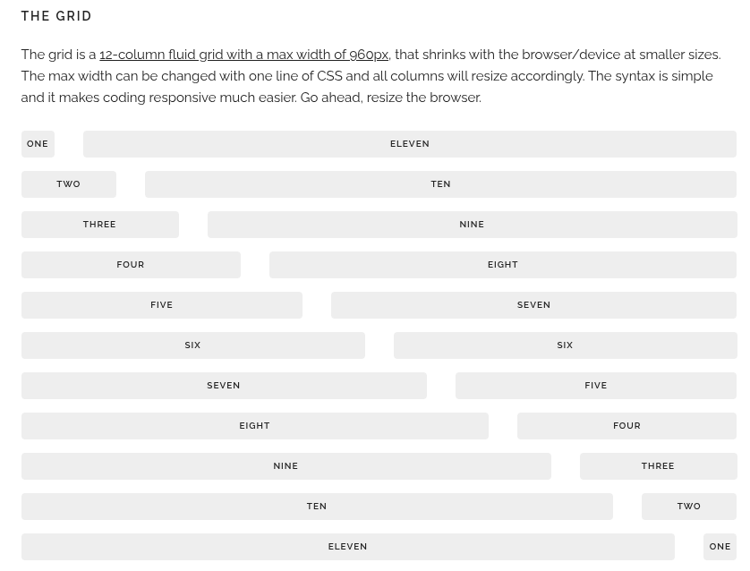

# Entry 4
##### 3/15/26

For my freedom project i will choose getskeleton. It is a lightweight boilerpoint at 400 lines of code. It is really easy to set up. It makes it possible for mobile devices to access the website too. For my backup tool i will chose aframe because it is a very cool tool to see objects in 3d and to make a mini game inside it. 

Code:
<pre class="code-example"><code class="code-example-body prettyprint">&lt;!-- .container is main centered wrapper --&gt;
&lt;div class="container"&gt;

  &lt;!-- columns should be the immediate child of a .row --&gt;
  &lt;div class="row"&gt;
    &lt;div class="one column"&gt;One&lt;/div&gt;
    &lt;div class="eleven columns"&gt;Eleven&lt;/div&gt;
  &lt;/div&gt;

  &lt;!-- just use a number and class 'column' or 'columns' --&gt;
  &lt;div class="row"&gt;
    &lt;div class="two columns"&gt;Two&lt;/div&gt;
    &lt;div class="ten columns"&gt;Ten&lt;/div&gt;
  &lt;/div&gt;

  &lt;!-- there are a few shorthand columns widths as well --&gt;
  &lt;div class="row"&gt;
    &lt;div class="one-third column"&gt;1/3&lt;/div&gt;
    &lt;div class="two-thirds column"&gt;2/3&lt;/div&gt;
  &lt;/div&gt;
  &lt;div class="row"&gt;
    &lt;div class="one-half column"&gt;1/2&lt;/div&gt;
    &lt;div class="one-half column"&gt;1/2&lt;/div&gt;
  &lt;/div&gt;

&lt;/div&gt;

&lt;!-- Note: columns can be nested, but it's not recommended since Skeleton's grid has %-based gutters, meaning a nested grid results in variable with gutters (which can end up being *really* small on certain browser/device sizes) --&gt;
</code>
</pre>

[Previous](entry03.md) | [Next](entry05.md)

[Home](../README.md)
